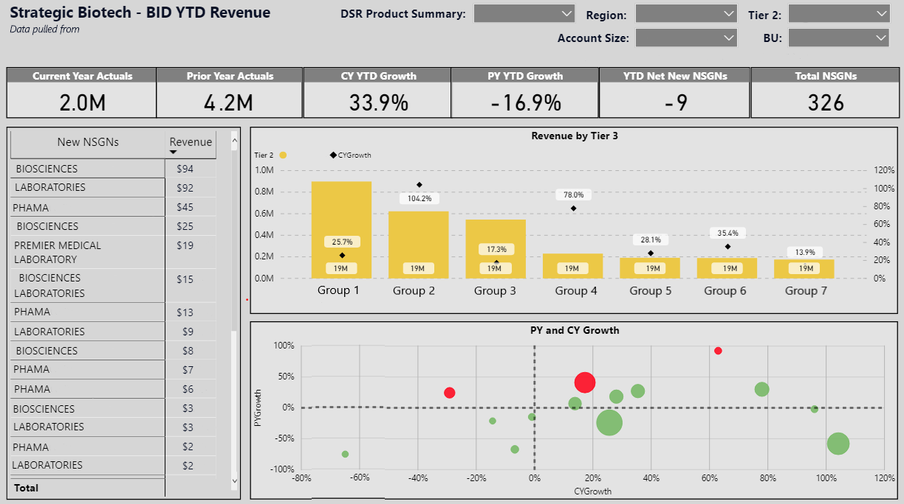

## Relational Databases and Mapping

This project primmarily dealt with creating a **key** build a relationship between **Excel** and a data table pull **via SQL**,
Because the two datasets were from different data sources consolidating them required cleaning prior and cross-functional collaboration.
One feature utilized within the **query editor** in Power BI *pivoting* columns. This had the possibility of doubling or tripling the 
actuals. As a result I divided the acutals, show in the code below:

    Revenue = 
    Merge1[Amount P$]/ 
    CALCULATE ( DISTINCTCOUNT(Merge1[Attribute]) , ALLEXCEPT(Merge1 , Merge1[NSGN Name]))

This is used for the base revenue for any standard measured such as year-to-date and prior year growth. 
